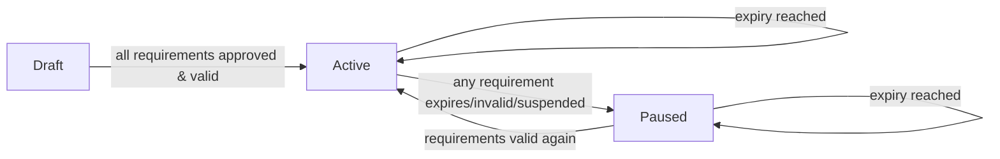

# Staff Management Subsystem & TOR Model

The conceptual backbone of the new **Staff Management subsystem** ([[TAT-409 Staff Management Subsystem|epic TAT-409]]). This note is the *domain reference* — what a TOR is, its lifecycle, the forms that feed it, and how it gates assignment. The ticket-by-ticket plan lives in the [[TAT-409 Staff Management Subsystem|epic tracker]].

## What it is

A **new internal subsystem** for managing TAT staff (primarily **instructors**) and their **TORs** — *Terms of Reference*, the per-authority training authorizations that decide whether an instructor is eligible to be assigned to courses, exams, and assessments. It sits alongside the existing [[TAT Platform]] frontends, on a **separate subdomain** with **SSO** from the main TAT dashboard (no second login).

> [!info] Greenfield — no code exists yet
> Confirmed by code search (2026-06-04): there is **zero** TOR / staff-management code in [[tat-ws]] or any other repo, and no separate repo exists yet. This is a brand-new build. Which repo hosts it is an **open question** — see [[TAT-409 Staff Management Subsystem#Open questions]].

## The TOR — core entity

A **TOR** belongs to an **Instructor Profile** and one **license authority**. When the Instructor role is granted, the system auto-creates exactly **three TORs**: **CARC**, **EASA**, **GCAA** (one per authority; duplicates prevented). `TAT-410`

### TOR lifecycle (status is system-calculated, never manually edited) `TAT-411`

- **Draft** → initial state. Expiry Date stays empty.
- **Active** → all required certs, courses, forms, and license-specific requirements are approved & valid. On *first* becoming Active: Creation Date set, **Expiry = Active Date + 2 years**.
- **Paused** → any requirement expires/invalid/missing, or Quality Manager suspends/revokes.
- **Auto-renew every 2 years**: at expiry the system renews Expiry (+2y) **regardless of requirement validity** — it never becomes "Expired". If requirements are invalid at renewal, status stays/goes **Paused** but the date still rolls.
- Each TOR carries: License Type, Status, Creation Date, Expiry Date, Scope of Approval.
- Status recalculates on *any* requirement event (doc/course/form/qualification approved, rejected, expired, replaced, refresher completed…). Full audit log required.

## The four forms

| Form | Scope | Workflow (who fills → who approves) | Ticket |
|------|-------|-------------------------------------|--------|
| **Form 285** | **CARC TOR only** | Instructor fills → system auto-fills org fields → **Accounting Manager** edits/submits → **Super Admin** downloads, uploads *signed* PDF → Approved | `TAT-414` |
| **Form 32** | CARC + EASA + GCAA, **per aircraft type** | Role-typed: **A** Theoretical Instructor / **B** Practical Instructor / **C** Examiner / **D** Assessor (multi-select). Instructor fills sections (option + evidence + notes) → TM/QM/SA **field-level** review → SA assessment fields → Approved | `TAT-415` (submit) · `TAT-416` (review) |
| **History Form** | **One shared form per instructor** (synced across all TORs) | Instructor fills basic info → **Training Manager** approves (field-level reject w/ reason). Plus optional aircraft quals + training history (no approval). Sit-In + final assessment close it out | `TAT-417` (create) · `TAT-418`/`419` (training & validity + review) · `TAT-421` (Sit-In & final assessment) |
| **Assessment Form** | Per **aircraft type**; type = Initial / Continuation / Extension | SA/TM assign to instructor → instructor fills (name/sig/date + optional evidence video) → **Training Manager** signs → Approved | `TAT-423` |

> [!note] The "privileged-role auto-approve" pattern (repeats on every form)
> On almost every form/document ticket, when **Super Admin / Admin / Quality Manager / Training Manager** fill or update a field, the system **auto-approves it and skips the approval workflow** — but required evidence/certificate uploads stay mandatory. Build this as a shared rule, not per-form. See [[Patterns]].

## Initial TOR documents `TAT-412` (upload) · `TAT-413` (review)

Uploaded **once**, **synced across all three TORs** for the instructor. Required: **CV, Passport, Degree, AML, 145 Auth** (need PIC approval). Optional: **External TOR** (no approval, deletable). Replace → new version becomes active Draft, archives previous, and **any Active TOR depending on it → Paused** until re-approval. Reject requires a reason; never auto-falls-back to the prior approved version.

## Mandatory training & refreshers `TAT-418` / `TAT-419` · courses `TAT-420`

- **All-role courses**: HF, MTOE, Aviation Legislation, Current Technologies & Latest Training Techniques.
- **Role-based**: Train the Trainers (Instructor), Train the Assessors (Assessor), Train the Examiners (Examiner) — shown dynamically by role.
- These 7 become **protected system online courses** — not deletable, "Delete" → "Archive". `TAT-420`
- Validity: Due = Accomplished + 2y; **Refresher Date = Due − 1 month**. System tracks total training duration in a rolling 2-year window; expired durations drop off automatically.
- **Refreshers are delivered as online courses inside the system** — completion auto-updates accomplished/due/refresher/validity, no manual cert upload.
- Refresher-course certificates are **hidden from the user until the Super Admin publishes** them (on Manage Trainees). `TAT-436` — note this touches the existing [[tat-ws]] / [[TAT-428 Edit Issued Certificates|certificate]] surface.

## TOR eligibility → the whole point `TAT-424`

**TOR is the single source of truth for instructor assignment eligibility.** Existing license/role/document/course/aircraft checks become *inputs into* TOR status, not separate rules. An instructor is assignable only with a **matching-license TOR in `Active`** plus a valid requested qualification matching the required **aircraft type and/or role**. Draft/Paused instructors are **hidden entirely** from assignment lists — **no override** for any role. Applies to course/examiner/assessor/assessment/aircraft assignment, single and bulk. Related: [[TAT-429]] adds instructors to the course enrollment list (feeds the History Form Sit-In flow in [[TAT-421]]).

## The pages (frontend) `TAT-431`–`TAT-435`

| Page | Who | Purpose |
|------|-----|---------|
| **Manage Staff** | Super Admin only | Table of all staff (name/email/role/status/edit), search, role filter, active count, add/edit staff `TAT-431` |
| **Staff Profile Management** | Super Admin | Profile + roles + contacts + status + TORs at bottom; **Deactivate Staff** (continue vs suspend qualification tracking; blocked if active assignments exist) `TAT-432` |
| **Staff TOR Matrix** | Admin/SA/QM/TM/Exam Mgr | Centralized matrix of all staff TOR statuses; expandable cards; filter by aircraft; live indicators `TAT-433` |
| **Pending TORs** | SA/TM/QM | Staff with ≥1 pending-approval form/field; drill into TOR Details; highlight rejected/waiting/expired/missing `TAT-435` |

## Roles in play

Training Manager, Admin, Super Admin, Examination Manager, Examiner, Invigilator, Instructor, Quality Manager, Accountable Manager, Practical Assessor, **Accounting Manager** (Form 285). Many overlap with [[tat-ws]]'s 13+ roles — see [[TAT API & Auth Model]] for the RBAC/permission model this should reuse.

## Related

- [[TAT-409 Staff Management Subsystem]] — the epic tracker with all 21 tickets and the build plan
- [[TAT Platform]] · [[tat-ws]] · [[tat-app-ws Backend]] · [[TAT API & Auth Model]]
- [[TAT-428 Edit Issued Certificates]] / [[TAT Certificates - Open Items]] — adjacent certificate surface that `TAT-436` extends
