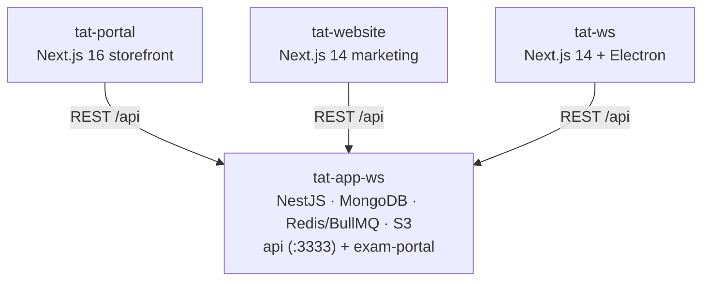

# TAT Platform

**Total Aviation Training** (tat147.com) — an aviation e-learning platform. The product spans a public marketing site, a student course storefront, a staff/exam desktop dashboard, and a single backend that serves them all. Source repos live under `~/Desktop/WebProjects/obsidian-mind/TAT/`.

## The Repos

| Repo | Role | Note |
|------|------|------|
| `tat-app-ws` | **Backend hub** — serves every frontend | [[tat-app-ws Backend]] |
| `tat-portal` | Student e-learning storefront (buy/learn/exam/certs) | [[tat-portal]] |
| `tat-website` | Public marketing site | [[tat-website]] |
| `tat-ws` | Desktop dashboard + proctored kiosk exams (staff, 13+ roles) | [[tat-ws]] |
| `tat-prereq` | **New** — Staff Management subsystem (instructors + TORs), SSO subdomain | [[tat-prereq]] |
| `tat-mind` | This vault — external brain for the work | — |

## How It Connects

- **`tat-app-ws` is the center of gravity.** All three frontends consume its REST API. Changes to the API contract ripple outward — see [[TAT API & Auth Model]].
- Auth is consistent everywhere: Bearer **access token** + **refresh-token rotation** on 401.
- Payments run through **CCAvenue** (gateway-hosted form POST; the apps never touch card data).
- Protected learning media is served via **S3 signed URLs**.

## Documentation State

- **Best documented:** `tat-portal` — has `ARCHITECTURE.md` + its own repo-local `obsidian/` vault.
- **Has repo-local notes:** `tat-ws` (`obsidian/` folder).
- **Weakly documented (Nx boilerplate only):** `tat-website`, `tat-app-ws` — highest risk when making changes blind.

> [!note] Repo-local `obsidian/` vs this vault
> `tat-portal/obsidian/` and `tat-ws/obsidian/` are *handoff docs that live with the code* (architecture, patterns, execution plans). This vault (`tat-mind`) is your *personal brain* — decisions, progress, wins, people. Reference repo docs from here; don't duplicate them.

## Related

- [[TAT API & Auth Model]] — the shared contract every frontend depends on
- [[TAT Delivery Orchestrator]] — design-stage multi-agent pipeline that drives these repos as stations
- [[North Star]] — current focus
- Active work: see [[Index|Work Notes]]
